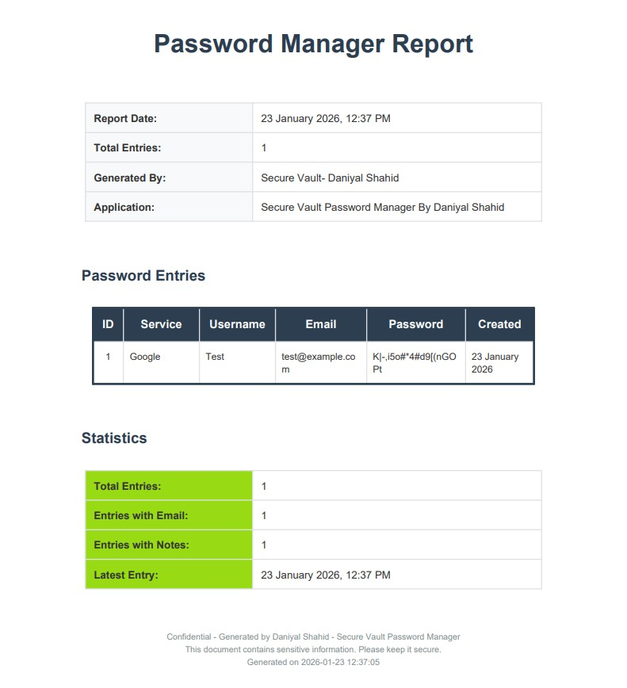

# Secure Vault Password Manager 🔐


A modern, secure, local password manager with a beautiful PyQt5 GUI interface. All passwords are encrypted before storage and never saved in plaintext. Features include **Dark Mode**, **PDF Export**, **Export/Import functionality**, **sequential ID management**, and support for **email/notes fields**.

## ✨ Features

### 🔒 Security Features
- **Military-grade Encryption**: AES-128-CBC with HMAC-SHA256 authentication
- **Master Password Protection**: PBKDF2 with 600,000 iterations
- **Zero-knowledge Architecture**: Only you can access your passwords
- **Encrypted Storage**: Passwords never stored in plaintext
- **Secure Random Generation**: Cryptographically secure password generation
- **Data Integrity**: SHA-256 verification for export files

### 📊 Core Functionality
- **Modern PyQt5 GUI**: Beautiful, responsive interface with gradient buttons
- **Dark Mode Support**: Toggle between light and dark themes
- **PDF Export**: Generate professional PDF reports with all password entries
- **Smart Search**: Search by service, username, or email
- **Password Generator**: Configurable secure password generation with strength analysis
- **Strength Analysis**: Real-time password strength evaluation with entropy calculation
- **Export/Import**: Encrypted backup and migration with separate export passwords
- **Sequential IDs**: Clean 1,2,3,4... display even after deletions
- **Extended Fields**: Email and Notes support for each entry
- **Clipboard Integration**: One-click copy passwords
- **History Tracking**: Creation timestamps in readable format
- **Beautiful Styling**: Modern gradient buttons, hover effects, and professional UI

### 🎯 New in Version 1.2.0
- **Dark Mode**: Beautiful dark theme with proper styling for all dialogs
- **PDF Export**: Professional PDF reports with formatted dates and password visibility
- **Modern PyQt5 GUI**: Upgraded from Tkinter to PyQt5 for better performance
- **Enhanced Button Styling**: Gradient buttons with hover effects
- **Readable Date Formats**: All dates displayed in human-readable format (e.g., "23 January 2026, 11:17 AM")
- **Text Wrapping**: Proper text wrapping in PDF tables to prevent overflow
- **Improved Dialog Styling**: All dialogs (QMessageBox, QInputDialog) support dark mode
- **Better Table Display**: Enhanced table styling with proper date formatting

## 📸 Screenshots

## 📸 Application Screenshots

### 🚀 First Run Setup Dialog


---

### ℹ️ About Section


---

### 🔑 Password Generator Interface


---

### 🌙 Dashboard with Dark Mode


---

### 🔐 Main Dashboard (Light Mode)


---

### 📄 PDF Report Export Feature


**Features:**
- Light/Dark mode toggle
- Gradient button styling with hover effects
- Search functionality
- Password strength indicator
- One-click password copy
- Professional table display with readable dates

### CLI Interface
```
==========================================================
Secure Vault Password Manager - CLI Version 1.0.0
==========================================================

----------------------------------------
MAIN MENU
----------------------------------------
1. Add new password entry
2. Get password entry  
3. Delete password entry
4. Generate secure password
5. List all entries
6. Change master password
7. Export passwords
8. Import passwords
9. Exit
----------------------------------------
```

## 🚀 Quick Start

### Prerequisites
- Python 3.7 or higher
- pip package manager

### Installation

1. **Clone the repository**
```bash
git clone https://github.com/skilldevloper/secure-vault-password-manager.git
cd secure-vault-password-manager
```

2. **Install dependencies**
```bash
pip install -r requirements.txt
```

**Or install manually:**
```bash
pip install PyQt5 reportlab pyperclip cryptography
```

**Required Dependencies:**
- `PyQt5` - Modern GUI framework
- `reportlab` - PDF generation
- `pyperclip` - Clipboard operations
- `cryptography` - Encryption/decryption

3. **Optional: Install Tkinter (Linux)**
```bash
# Ubuntu/Debian
sudo apt-get install python3-tk

# Fedora/RHEL
sudo dnf install python3-tkinter

# Arch Linux
sudo pacman -S tk
```

### Running the Application

**GUI Version (PyQt5):**
```bash
python gui_app_updated.py
```

**Note:** Make sure you have PyQt5 installed:
```bash
pip install PyQt5 reportlab pyperclip cryptography
```

**CLI Version (Legacy):**
```bash
python app.py
```

## 📁 Project Structure

```
secure-vault-password-manager/
├── gui_app_updated.py   # Main GUI application (PyQt5) ⭐
├── app.py                # CLI application (Legacy)
├── gui_app.py            # Old Tkinter GUI (Legacy)
├── db.py                 # Database operations (SQLite)
├── crypto_utils.py       # Encryption/decryption utilities
├── password_generator.py # Secure password generation
├── config.py            # Configuration constants
├── requirements.txt     # Python dependencies
├── vault.db            # Encrypted SQLite database (auto-created)
├── LICENSE             # MIT License
├── README.md          # This file
└── Images/            # Button icons (optional)
    ├── add.png
    ├── update.png
    ├── delete.png
    ├── copy.png
    ├── dark.png
    ├── generate.png
    └── ...
```

## 🛠️ Usage Guide

### First Run Setup
On first launch, you'll be prompted to create a master password:
- Minimum 8 characters
- Strongly recommended: 12+ characters with mixed types
- This password encrypts ALL your stored passwords
- **IMPORTANT**: If lost, your data cannot be recovered!

### Dark Mode
Toggle between light and dark themes:
- Click "Dark Mode" button to switch themes
- All dialogs (error messages, input dialogs) automatically adapt
- Theme preference is maintained during the session

### Adding a New Entry

**In GUI (PyQt5):**
1. Click "Authenticate" and enter master password
2. Fill in Service (optional), Username (required), Email (optional)
3. Enter password or click "Generate Password" button
4. Add notes if needed in the notes field
5. Click "Add Entry" button
6. View password strength indicator in real-time

**In CLI:**
```bash
# Select option 1 from main menu
Service: github.com
Username: yourusername
Email: user@example.com
Password: [Enter or generate]
Notes: [Optional multi-line notes]
```

### Searching and Retrieving

**Search by:**
- Service name (github.com)
- Username (yourusername)
- Email (user@example.com)

**Features:**
- Fuzzy search across all fields
- Sequential ID display (1,2,3,4...)
- One-click copy to clipboard
- View encrypted creation date

### Password Generation

**Options available:**
- Length: 8-50 characters (adjustable via slider)
- Character sets: Lowercase, Uppercase, Digits, Symbols
- Strength evaluation with entropy calculation (bits)
- Real-time strength indicator in main window
- Auto-copy to clipboard
- Use generated password directly in entry form

### Export/Import Feature

**Export to Encrypted File:**
1. Click "Export" button
2. Enter export password (different from master password)
3. Choose save location
4. Encrypted `.enc` file created

**Export to PDF:**
1. Click "PDF Export" button
2. Choose save location
3. Professional PDF report generated with:
   - All entries with passwords
   - Formatted dates (e.g., "23 January 2026")
   - Statistics and metadata
   - Properly wrapped text in tables

**Import:**
1. Click "Import" button
2. Select export file (`.enc` format)
3. Enter export password
4. Choose duplicate handling (skip or overwrite)
5. Data restored with progress indicator

## 🔐 Security Architecture

### Encryption Stack
```
User Master Password
        ↓
PBKDF2-HMAC-SHA256 (600,000 iterations)
        ↓
Fernet Key (AES-128-CBC + HMAC-SHA256)
        ↓
Encrypted Password Storage
```

### Database Schema
```sql
CREATE TABLE vault (
    id INTEGER PRIMARY KEY AUTOINCREMENT,
    service TEXT,
    username TEXT NOT NULL,
    password TEXT NOT NULL,  -- Encrypted
    email TEXT,
    notes TEXT,
    created_at TEXT NOT NULL
);
```

### Security Best Practices Implemented
1. **Salt per installation**: Unique salt for key derivation
2. **Authenticated encryption**: Detects tampering attempts
3. **Memory safety**: Passwords cleared from memory after use
4. **Input validation**: Sanitized all user inputs
5. **Error handling**: No sensitive information in error messages
6. **Export encryption**: Separate password for backup files

## 📊 Database Management

### Sequential ID System
```python
# Even if database IDs are 1, 3, 5 after deletions
# Display will always be: 1, 2, 3

Actual DB IDs: [1, 3, 5, 7]
Display IDs:   [1, 2, 3, 4]
```

### Migration from Previous Versions
The system automatically:
- Detects old database schema
- Adds new columns (email, notes)
- Preserves existing data
- Maintains backward compatibility

### Statistics
The GUI displays real-time statistics:
- Total Entries count
- Entries with Email count
- Entries with Notes count
- Latest Entry date (formatted as "23 January 2026, 11:17 AM")

## 🧪 Testing

### Running Tests
```bash
# Test basic functionality
python -c "from db import DatabaseManager; db = DatabaseManager(); print('DB OK')"

# Test encryption
python -c "from crypto_utils import CryptoManager; print('Crypto OK')"

# Test password generation
python -c "from password_generator import PasswordGenerator; pg = PasswordGenerator(); print(pg.generate_password())"
```

### Manual Testing Checklist
- [ ] First-run setup works
- [ ] Master password authentication
- [ ] Add/Edit/Delete entries
- [ ] Password generation
- [ ] Search functionality
- [ ] Export/Import
- [ ] Sequential ID display
- [ ] Email and Notes fields

## 🐛 Troubleshooting

### Common Issues

**Issue: "Tkinter not found" (Linux)**
```bash
# Install Tkinter
sudo apt-get install python3-tk  # Ubuntu/Debian
```

**Issue: Database locked**
```bash
# Close other instances
# Check for zombie processes
ps aux | grep python
kill -9 [process_id]
```

**Issue: Import password incorrect**
- Verify you're using export password, not master password
- Check for caps lock
- Try exact password used during export

**Issue: Images not loading**
- Create `Images` folder in project directory
- Add PNG images for buttons (optional)
- Or system will use text buttons automatically

**Issue: PyQt5 not found**
```bash
pip install PyQt5
```

**Issue: PDF export not working**
```bash
pip install reportlab
```

### Logs
Enable debug logging:
```python
# Add to any file
import logging
logging.basicConfig(level=logging.DEBUG)
```

## 🔄 Export/Import Format

### Export File Structure (JSON)
```json
{
  "metadata": {
    "export_date": "2024-01-15T14:30:00",
    "total_entries": 15,
    "app_version": "1.0"
  },
  "entries": [
    {
      "service": "github.com",
      "username": "user123",
      "password": "decrypted_password",
      "email": "user@example.com",
      "notes": "Personal account",
      "created_at": "2024-01-10T10:30:00"
    }
  ]
}
```

### Encryption Process
1. Data serialized to JSON
2. New salt generated for export
3. PBKDF2 key derivation from export password
4. Fernet encryption of JSON data
5. SHA-256 hash for integrity check
6. All components packaged in export file

## 📈 Performance

### Database Operations
| Operation | Average Time | Notes |
|-----------|--------------|-------|
| Add Entry | < 50ms | Includes encryption |
| Search | < 100ms | With 1000+ entries |
| Export (Encrypted) | ~1s per 100 entries | Depends on size |
| Export (PDF) | ~2s per 100 entries | Includes formatting |
| Import | ~2s per 100 entries | Includes decryption |

### Memory Usage
- Base: ~60MB (PyQt5 GUI)
- Per 1000 entries: +~10MB
- Peak during encryption: +~5MB
- Dark mode: No additional overhead

## 🤝 Contributing

We welcome contributions! Please follow these steps:

1. **Fork the repository**
2. **Create a feature branch**
```bash
git checkout -b feature/amazing-feature
```
3. **Commit your changes**
```bash
git commit -m 'Add amazing feature'
```
4. **Push to the branch**
```bash
git push origin feature/amazing-feature
```
5. **Open a Pull Request**

### Development Guidelines
- Follow PEP 8 style guide
- Add docstrings to all functions
- Include unit tests for new features
- Update documentation
- Maintain backward compatibility

### Areas for Contribution
- [x] Dark Mode Support ✅
- [x] PDF Export ✅
- [x] Modern PyQt5 GUI ✅
- [ ] Additional encryption algorithms
- [ ] Cloud sync integration
- [ ] Browser extension
- [ ] Mobile app
- [ ] Two-factor authentication
- [ ] Password sharing (encrypted)
- [ ] Automatic backup scheduling
- [ ] Password health checker
- [ ] Theme customization

## 📚 API Documentation

### DatabaseManager Class
```python
# Key methods
db = DatabaseManager()
db.add_entry(service, username, encrypted_password, email, notes)
db.get_entries_with_sequential_ids()  # Returns 1,2,3,4... IDs
db.search_entries(term)  # Search across all fields
db.get_statistics()  # Get database stats
```

### CryptoManager Class
```python
crypto = CryptoManager(db)
crypto.authenticate(password)  # Master password auth
crypto.encrypt_password(plaintext)
crypto.decrypt_password(encrypted)
crypto.export_data_with_password(data, export_password)
crypto.import_data_with_password(export_package, import_password)
```

### PasswordGenerator Class
```python
pg = PasswordGenerator()
pg.generate_password(length=20, include_symbols=True)
pg.evaluate_strength(password)  # Returns strength analysis
pg.calculate_entropy(password)  # Entropy in bits
```

## 🌐 Browser Integration (Future)

Planned browser extension features:
- Auto-fill passwords
- Password capture on signup
- Security alerts for weak/reused passwords
- One-click login

## 🏆 Best Practices

### For Users
1. **Use a strong master password**: 12+ characters, mixed types
2. **Regular backups**: Export monthly or after major changes
3. **Different export password**: Don't reuse master password
4. **Secure storage**: Keep export files in encrypted drives
5. **Update regularly**: Check for security updates

### For Developers
1. **Never log sensitive data**: Passwords, keys, etc.
2. **Use parameterized queries**: Prevent SQL injection
3. **Validate all inputs**: Sanitize user data
4. **Handle errors gracefully**: No stack traces to users
5. **Regular security audits**: Review crypto implementation

## ⚠️ Security Considerations

### What This Software Does
- Encrypts passwords with strong cryptography
- Stores data locally only
- Provides secure password generation
- Allows encrypted backups

### What This Software Does NOT Do
- Recover lost master passwords
- Sync to cloud automatically
- Protect against keyloggers
- Secure the underlying OS
- Prevent physical access attacks

### Recommended Additional Measures
1. **Full disk encryption** (BitLocker, FileVault, LUKS)
2. **Regular system updates**
3. **Antivirus software**
4. **Firewall protection**
5. **Physical security** of devices

### Third-Party Licenses
- **PyQt5**: GPL v3 or Commercial License
- **cryptography**: Apache License 2.0
- **reportlab**: BSD License
- **pyperclip**: BSD License

## 🙏 Acknowledgments

- Python Cryptography team for the excellent `cryptography` library
- Al Sweigart for `pyperclip`
- The open-source community for inspiration and tools
- All contributors who help improve this project

## 📞 Support

### Need Help?
1. **Check the documentation** first
2. **Search existing issues** on GitHub
3. **Enable debug logging** for more details
4. **Create a new issue** with:
   - Error messages
   - Steps to reproduce
   - System information
   - Screenshots if applicable

### Community Support
- GitHub Discussions: For questions and ideas
- Issue Tracker: For bug reports
- Pull Requests: For contributions

## 🌟 Star History

[](https://star-history.com/#skilldevloper/secure-vault-password-manager&Date)

---

## 📊 Project Status

**Current Version**: 1.2.0  
**Last Updated**: January 2026  
**Python Support**: 3.7+  
**GUI Framework**: PyQt5  
**Active Development**: Yes  
**Security Audited**: Self-audited

### Version History
- **v1.2.0** (Current): PyQt5 GUI, Dark Mode, PDF Export, Enhanced Styling
- **v1.1.0**: Email/Notes fields, Sequential IDs, Enhanced Search
- **v1.0.0**: Initial release with Tkinter GUI  

---

**Disclaimer**: This software is provided "as is" without warranty. Use at your own risk. The authors are not responsible for any data loss or security breaches.

**Remember**: Your security is your responsibility. Use strong passwords, keep backups, and stay informed about security best practices.

---

<div align="center">
  
Made with ❤️ by Daniyal Shahid

[](https://github.com/yourusername/secure-vault-password-manager)
[](https://python.org)
[](https://)

</div>

## 🎯 Quick Links
- [Features](#-features)
- [Installation](#-installation)
- [Usage](#-usage-guide)
- [Security](#-security-architecture)
- [Contributing](#-contributing)
- [License](#-license)

---

**Happy and Secure Password Managing!** 🔐
